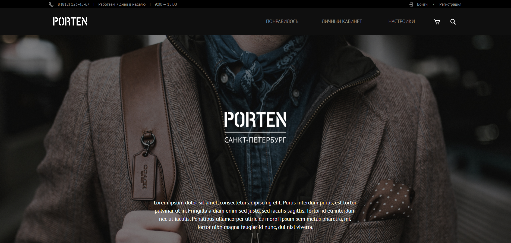
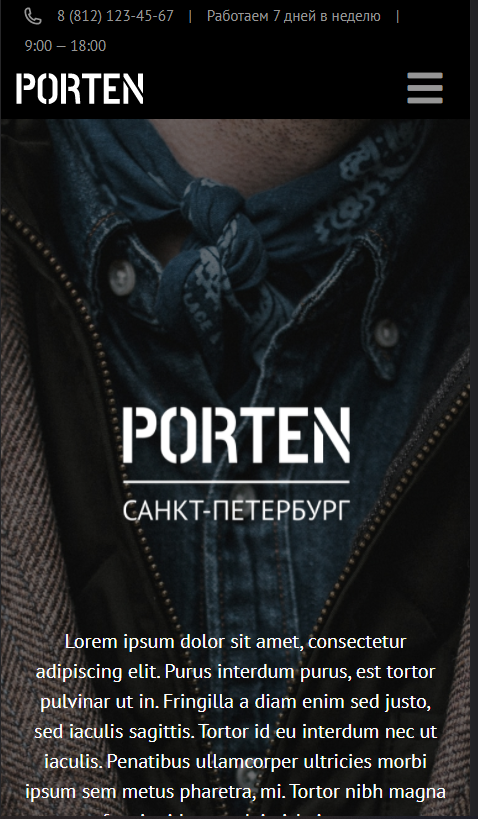
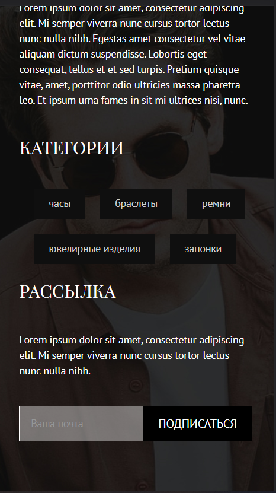
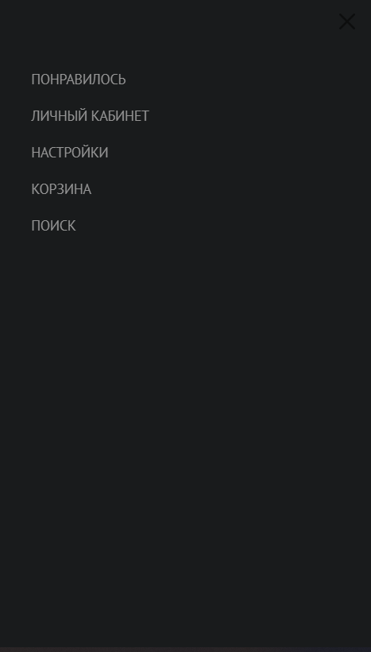

# Porten shop
Шаблон сайта интернет-магазина мужских товаров

## Описание
Выполнение тренировочного шаблона по верстке адаптивного сайта.
[Макет в Figma](https://www.figma.com/file/9bcEJNVdyhM1kLAWQbVV6a/Templates-%2317.-More-on-Figma.info?node-id=0%3A1)

## Стек

+ Pug
+ Sass
+ Bootstrap
+ Fontawesome
+ Gulp

## Команды
+ gulp dev - старт сервера разработки

+ gulp build - сборка проекта

